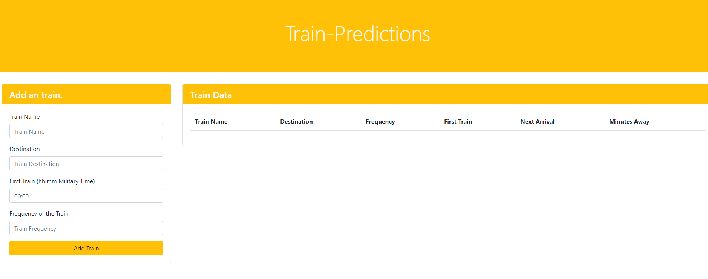
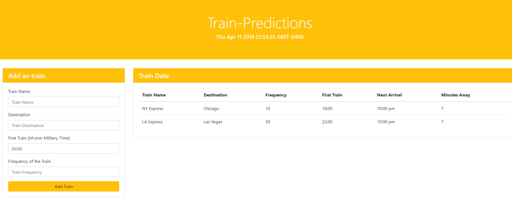

# TrainPredictions

### Link: https://mpj1693.github.io/TrainPredictions/

### Overview

In this webpage you can train name, time and frequency of the train and it will display the time when the another train be back at that station and in how many minutes.

### Languages

* Javascript
* HTML
* JQuery

### Technologies Used
* Firebase
* Moment.js

### Explaination

* This is the home page

* On entering all the values in the form, you can add all the details to the table.
* The table will then display the amount of time(minutes) it will take that train to come to the same station again and also display the exat time when the train will be there. 

* Everything until now happened without reloading the page. Even if the page is reloaded, the contents of the table will not be deleted, because the data is stored in Firebase.
* Everytime the page is loaded, the old data will also be loaded with it.

### Author

Manav Patel
